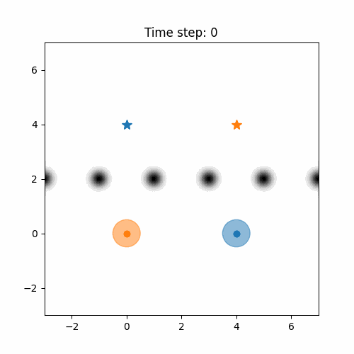
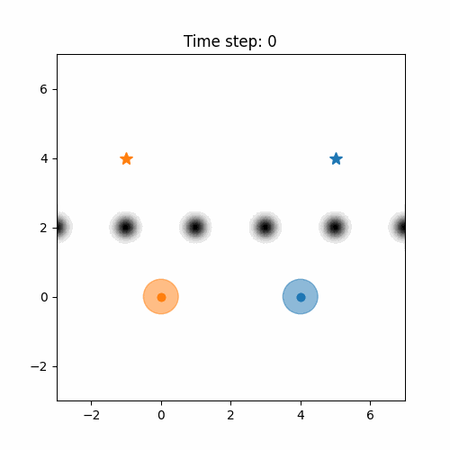

# Coordination in mountain range problem

The following gifs show trajectories of the vehicles before and after the training with the rPB framework, where the agents need to coordinate in order to pass through an array of narrow passages while trying to minimize the travelled distance, starting from a random initial position marked with &#9675;. The robots have been trained over several targets at once, and below two examples are displayed. 

## Diagonal objectives 

The targets are on the opposite side horizontally, so the best path for both is to pass through the central passage.  

<table>
  <tr>
    <td align="center">
      <b>Before Training</b> 
      
    </td>
    <td align="center">
      <b>After Training</b> 
      
    </td>
  </tr>
</table>

## Direct objectives 

The targets are on the same side as the initial positions, so the best path for both is to pass through the closest passage to their initial position.  

<table>
  <tr>
    <td align="center">
      <b>Before Training</b> 
      
    </td>
    <td align="center">
      <b>After Training</b> 
      
    </td>
  </tr>
</table>

